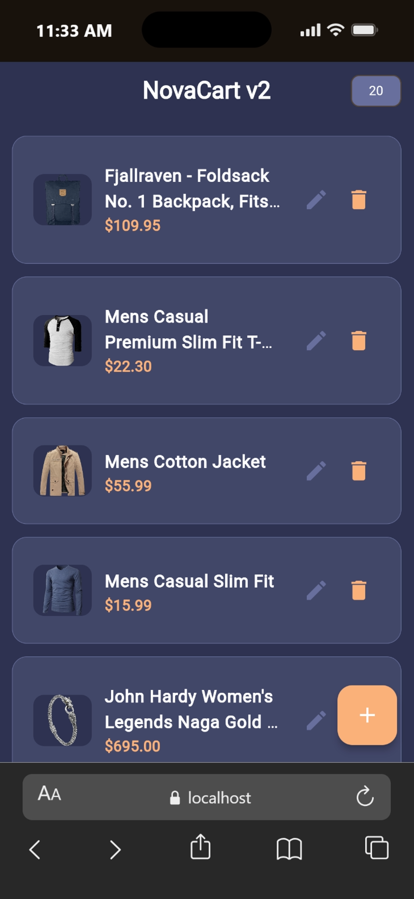
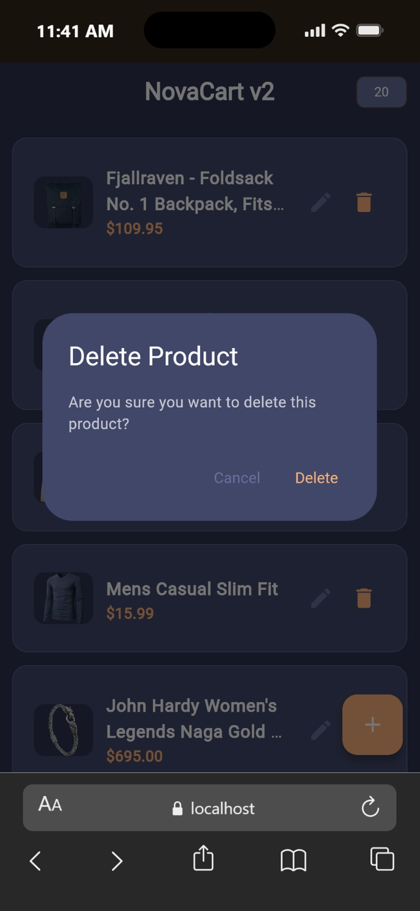
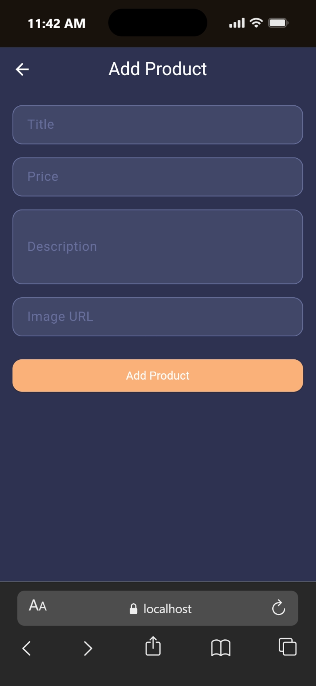
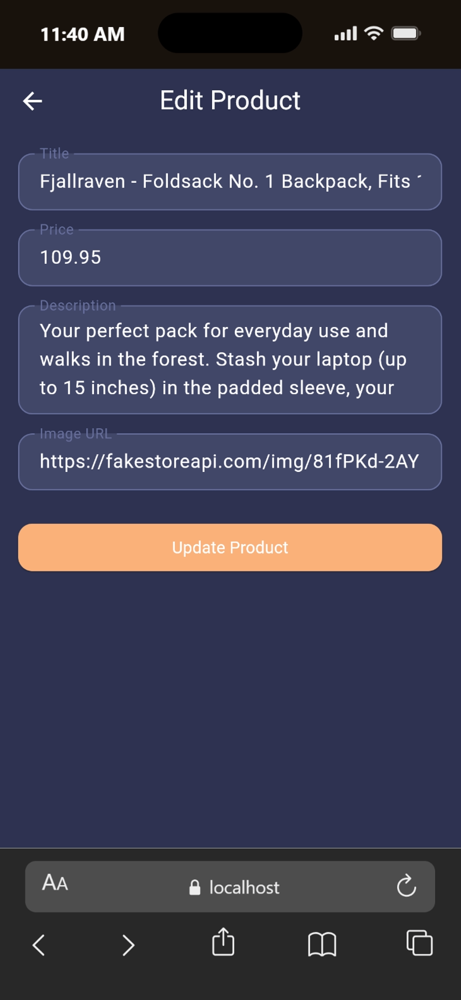
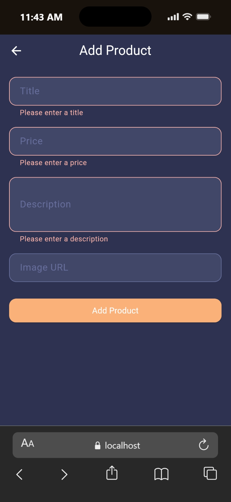
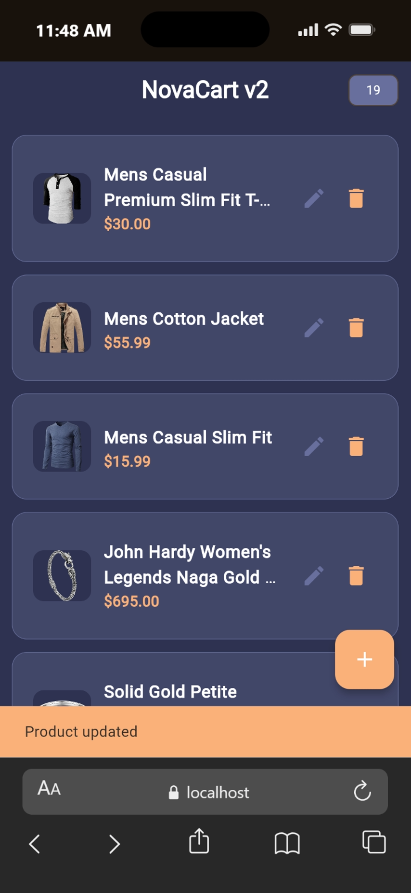
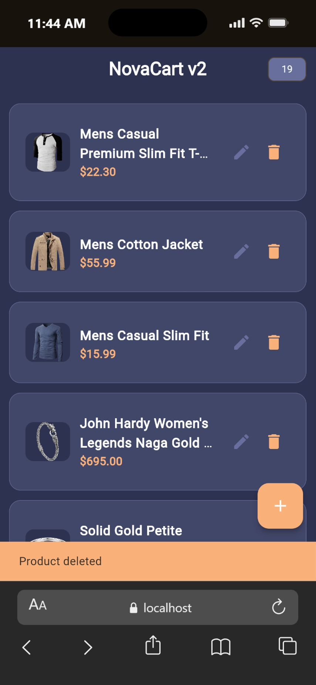

# NovaCart v2


A modern Flutter CRUD application powered by **Bloc** state management, **Dio** for networking, and the [Fake Store API](https://fakestoreapi.com/) (public REST API).

This is the v2 evolution of [NovaCart](https://github.com/YordanosBisrat/NovaCart), using the Bloc architecture pattern and Dio for advanced API handling.
This project was developed as part of a Mobile Application Development assignment focused on modern Flutter architecture and real-world application structure.

---

## Project Overview
NovaCart v2 is a polished e-commerce style application where users can:

- View products fetched from a remote API
- Add new products with form validation
- Edit existing products with pre-filled fields
- Delete products with a confirmation dialog
- Experience real-time UI updates driven by Bloc states

The project focuses on clean architecture, proper separation of concerns, Dio-based API integration, and Bloc-driven state management.

---

## Features

- **Read** — Fetches and displays all products from the Fake Store API
- **Create** — Add new products with full form validation
- **Update** — Edit existing products with all fields pre-filled
- **Delete** — Remove products with a confirmation dialog
- **Bloc State Management** - Clean separation of UI and business logic,Event-driven architecture, Reactive state updates
- **Networking with Dio** - REST API integration, Async request handling, Error handling support
- Loading states on all async operations
- Error state with retry button on the home screen
- Empty state with helpful message
- Image error fallback for broken URLs
- Item count badge in the app bar
- Operation-specific snackbars (add / update / delete) — no false success messages on initial load

---

## Screenshots

| Home | Delete Confirmation | 
|------|-------------------|
|  |  | 

| Add Product | Edit Product |
|-------------|--------------|
|  |  |


| Add Required to Fill | After Edit | After Delete |
|-------------|--------------|--------------|
|  |  |  |


---

## Project Structure

```
lib/
├── main.dart                          # App entry point, BlocProvider setup, theme
├── bloc/
│   └── product/
│       ├── product_bloc.dart          # Bloc — handles events, emits states
│       ├── product_event.dart         # Events: Load, Add, Update, Delete
│       └── product_state.dart         # States: Initial, Loading, Loaded, Success, Error
├── core/
│   └── network/
│       ├── dio_client.dart            # Dio instance with base URL and timeouts
│       └── api_endpoints.dart         # Centralized API endpoint constants
├── data/
│   └── datasources/
│       └── product_remote_data_source.dart  # All API calls via DioClient
└── presentation/
    └── screens/
        ├── home_screen.dart           # Product list with edit/delete actions
        ├── add_product_screen.dart    # Create product form
        └── edit_product_screen.dart   # Edit product form
```

---

## Architecture

```
UI Screens (BlocConsumer / BlocBuilder / BlocListener)
    │
    │  events: LoadProducts / AddProduct / UpdateProduct / DeleteProduct
    ▼
ProductBloc
    │  states: ProductInitial / ProductLoading / ProductLoaded
    │           ProductOperationSuccess / ProductError
    │  local list manipulation — no redundant re-fetches
    ▼
ProductRemoteDataSource
    │  getProducts / addProduct / updateProduct / deleteProduct
    ▼
DioClient (Dio — connectTimeout: 10s, receiveTimeout: 10s)
    │
    ▼
https://fakestoreapi.com/products
```

---

## API Reference
This project uses the Fake Store API:

##### Base URL:
```
https://fakestoreapi.com
```

> **Note:** Fake Store API is a mock/demo API. POST, PUT, and DELETE operations return valid responses but changes are not actually persisted on the server. The app updates its local state accordingly to reflect the expected behaviour.

---

## API Endpoints Used

| Method | Endpoint | Description |
|--------|----------|-------------|
| GET | `/products` | Fetch all products |
| POST | `/products` | Create a new product |
| PUT | `/products/:id` | Update an existing product |
| DELETE | `/products/:id` | Delete a product |

---

## Getting Started

### Prerequisites

- Flutter SDK ≥ 3.0
- Dart ≥ 3.0

### Run

```bash
git clone https://github.com/YordanosBisrat/NovaCart_v2.git
cd NovaCart_v2
flutter pub get
flutter run
```

To run on a specific platform:

```bash
flutter run -d chrome       # Web
flutter run -d windows      # Windows desktop
flutter run                 # Connected mobile device
```

---

## Tech Stack

- Flutter
- Dart
- Bloc / flutter_bloc
- Dio
- Equatable
- Fake Store API
- Material 3

---

## Dependencies

```yaml
flutter_bloc: ^9.1.1   # State management
dio: ^5.9.2            # Network requests
equatable: ^2.0.8      # Value equality for Bloc states and events
```

---

## Author
Developed as part of a Mobile Application Development assignment, focused on clean architecture, scalable state management, and real-world Flutter practices.

## Student Information

- **Name:** Yordanos Bisrat
- **ID:** UGR/3362/16
- **Section:** 1